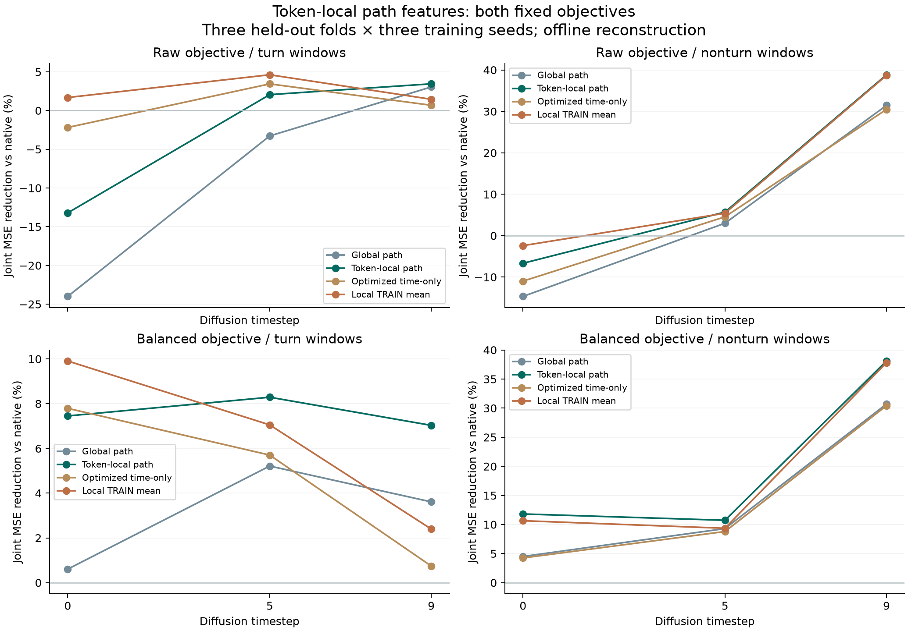
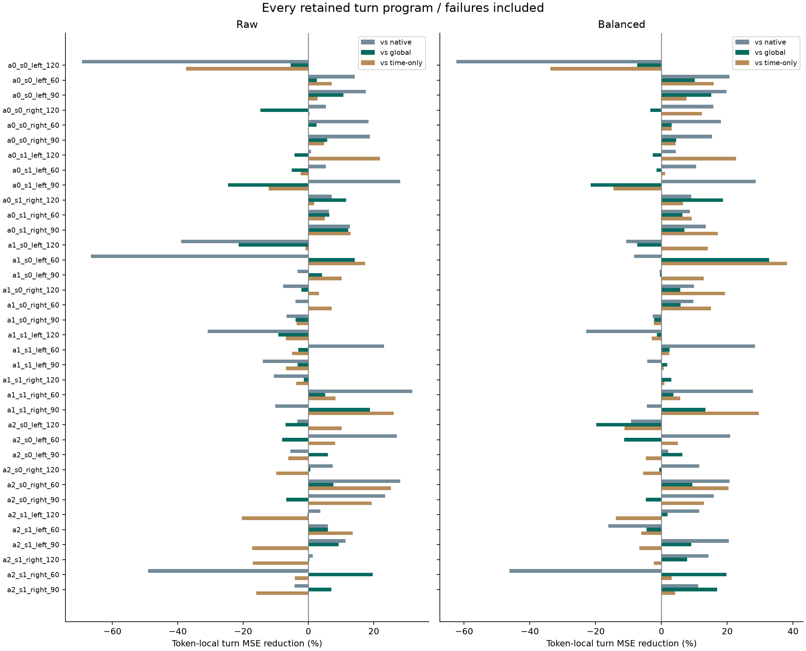

# M2p result: token-local requested-path representation

Completed 2026-09-05 under the frozen [execution contract](protocol.md) and [design](design.md). Exploratory offline development; no independent confirmation or navigation claim.

**Local path features improve reconstruction under the balanced objective.**

The balanced token-local head reduces turn-joint MSE by 7.21% versus native ARDY, 5.74% versus optimized time-only, and 3.57% versus the matched global-path head. Contact accuracy improves, and all six noise/stratum aggregates retain gains over native. Both representation and useful-path promotion gates still fail: the global-head gain is below 5%, the gain over its own TRAIN-mean control is 4.16%, and only 14/36 programs beat all primary controls. Raw token-local gains are smaller (2.93% versus native), with one training seed losing to the global head.

## What changed

Interpolate the eight 17-field requested-path nodes to the thirteen generated four-frame token centers. Unwrap angular fields before interpolation. Apply TRAIN-only raw and projected normalization and a fixed 17×64 Gaussian projection. Retain the 78,592-parameter head, 64 active path channels, phase/time codes, norm cap, optimizer settings, draws, and frozen ARDY backbone. This changes geometric scope and temporal alignment together; it does not isolate either cause.

Nine shared 1,000-update regression prefixes branch into raw and fixed M2o-balanced 500-update refinements: 18 endpoints and 18,000 new candidate optimizer updates. No weight, seed, fold or checkpoint selection follows outcomes. Separate preflights ran two 500-update cached replays (both passed); the second followed an import-format-only fix and supplies the final frozen source snapshot. Those 1,000 replay updates are implementation checks, not additional candidates.

Three held-out approach folds × seeds 17/29/43; 1,020 new held-out teachers (384 turn, 636 nonturn), each held out once per mode and seed. There are 24,480 new scores (9,216 turn), 30,600 cached comparison scores, and 2,040 cached native/oracle references. Every source/window/flag is retained. Source means are averaged within program, then across programs and training seeds. Both motion seeds stay with their program. Old development examples are excluded; original TEST is unused. The 36 factorial programs share six first-command prefixes and are not independent environments.

## Reconstruction and controls

Gain is 100×(1−candidate joint MSE/reference joint MSE). Positive favors the candidate. RMSE is the square root of aggregated coordinate MSE. Contact accuracy is a decoded-label metric, not physical validation.

| Mode | Turn RMSE mm | Turn gain vs native % | Turn contact % | Nonturn gain % | All-window gain % |
|---|---:|---:|---:|---:|---:|
| baseline | 17.203 | +0.0000 | 93.30262 | +0.0000 | +0.0000 |
| original_path_time | 18.332 | -13.5575 | 92.87675 | +4.8501 | -6.1208 |
| original_time_only | 17.940 | -8.7591 | 92.40526 | +7.4949 | -1.3438 |
| raw_path_time | 17.060 | +1.6535 | 93.54931 | +26.3593 | +13.3899 |
| raw_time_only | 17.116 | +1.0077 | 93.24252 | +25.8638 | +13.2135 |
| raw_time_mean | 16.856 | +3.9890 | 93.28370 | +26.7590 | +15.7366 |
| raw_shuffled_path | 17.164 | +0.4562 | 93.43468 | +23.3933 | +11.2102 |
| balanced_path_time | 16.875 | +3.7752 | 93.53818 | +27.2212 | +15.0607 |
| balanced_time_only | 17.068 | +1.5633 | 93.18911 | +26.9174 | +14.0773 |
| balanced_time_mean | 16.709 | +5.6566 | 93.28815 | +27.6032 | +16.9075 |
| balanced_shuffled_path | 16.992 | +2.4336 | 93.41020 | +25.4029 | +13.5144 |
| raw_local | 16.949 | +2.9345 | 93.59754 | +33.2390 | +17.6809 |
| raw_local_time_mean | 17.039 | +1.8945 | 93.18688 | +33.2565 | +18.3272 |
| raw_local_shuffled | 17.110 | +1.0717 | 93.37941 | +30.2159 | +15.2263 |
| raw_local_shifted | 17.379 | -2.0607 | 93.16240 | +13.0652 | +5.0757 |
| balanced_local | 16.571 | +7.2140 | 93.72181 | +33.9417 | +20.3520 |
| balanced_local_time_mean | 16.927 | +3.1847 | 93.35344 | +33.5049 | +19.1753 |
| balanced_local_shuffled | 16.869 | +3.8387 | 93.45360 | +31.5888 | +17.5306 |
| balanced_local_shifted | 17.039 | +1.8993 | 93.29965 | +15.4444 | +8.6950 |
| oracle | 8.963 | +72.8522 | 98.60777 | +80.4521 | +76.8736 |

## Every noise level

| Stratum | t | Raw global gain % | Raw local gain % | Balanced global gain % | Balanced local gain % |
|---|---:|---:|---:|---:|---:|
| turn | 0 | -24.0036 | -13.2141 | +0.6060 | +7.4529 |
| turn | 5 | -3.2797 | +2.0529 | +5.2133 | +8.2902 |
| turn | 9 | +3.0472 | +3.4467 | +3.6112 | +7.0319 |
| nonturn | 0 | -14.6704 | -6.6622 | +4.5020 | +11.8085 |
| nonturn | 5 | +3.0052 | +5.6908 | +9.2947 | +10.7272 |
| nonturn | 9 | +31.4588 | +38.8434 | +30.7111 | +38.1087 |

## Raw objective: frozen decisions

Representation: **FAIL**. Useful path: **FAIL**. Noise retention: **FAIL**.

| Requirement | Outcome |
|---|---|
| gain_over_global_at_least_5pct | Fail |
| contact_at_least_global | Pass |
| contact_at_least_native | Pass |
| all_three_seeds_beat_global | Fail |
| gain_baseline_at_least_5pct | Fail |
| gain_raw_time_only_at_least_5pct | Fail |
| gain_raw_local_time_mean_at_least_5pct | Fail |
| all_three_seeds_beat_native_and_time | Fail |
| same_26_of_36_programs_win | Fail |
| gain_shuffle_at_least_1pct | Pass |
| turn_t0 | Fail |
| turn_t5 | Pass |
| turn_t9 | Pass |
| nonturn_t0 | Fail |
| nonturn_t5 | Pass |
| nonturn_t9 | Pass |

| Training seed | Gain vs native % | Gain vs global % | Gain vs time-only % |
|---|---:|---:|---:|
| 17 | +1.9865 | -1.9867 | -1.5659 |
| 29 | +5.8745 | +3.4203 | +3.4746 |
| 43 | +0.9424 | +2.3836 | +3.7911 |

| Every retained program | Gain vs native % | Gain vs global % | Gain vs time-only % |
|---|---:|---:|---:|
| turn_event_a0_s0_left_120 | -69.2978 | -5.4088 | -37.4907 |
| turn_event_a0_s0_left_60 | +14.2123 | +2.6021 | +7.1804 |
| turn_event_a0_s0_left_90 | +17.5555 | +10.6969 | +2.8102 |
| turn_event_a0_s0_right_120 | +5.3822 | -14.6588 | +0.3646 |
| turn_event_a0_s0_right_60 | +18.4366 | +2.5073 | +0.1089 |
| turn_event_a0_s0_right_90 | +18.8066 | +5.8119 | +4.8378 |
| turn_event_a0_s1_left_120 | +0.7700 | -4.2221 | +21.8863 |
| turn_event_a0_s1_left_60 | +5.3635 | -5.0728 | -2.3593 |
| turn_event_a0_s1_left_90 | +28.0632 | -24.5605 | -12.1586 |
| turn_event_a0_s1_right_120 | +7.1231 | +11.5822 | +1.7760 |
| turn_event_a0_s1_right_60 | +6.2562 | +6.4315 | +5.0549 |
| turn_event_a0_s1_right_90 | +12.6812 | +12.1879 | +12.9217 |
| turn_event_a1_s0_left_120 | -38.9022 | -21.2779 | -0.9135 |
| turn_event_a1_s0_left_60 | -66.5511 | +14.1685 | +17.4015 |
| turn_event_a1_s0_left_90 | -3.2966 | +4.2205 | +10.1675 |
| turn_event_a1_s0_right_120 | -7.7764 | -2.1377 | +3.2776 |
| turn_event_a1_s0_right_60 | -3.9113 | +0.0232 | +7.1255 |
| turn_event_a1_s0_right_90 | -6.6373 | -3.9863 | -3.6085 |
| turn_event_a1_s1_left_120 | -30.8167 | -9.1634 | -6.8634 |
| turn_event_a1_s1_left_60 | +23.1629 | -3.0806 | -4.9976 |
| turn_event_a1_s1_left_90 | -13.9567 | -3.3387 | -6.8568 |
| turn_event_a1_s1_right_120 | -10.5671 | -1.4367 | -3.7027 |
| turn_event_a1_s1_right_60 | +31.8250 | +5.1571 | +8.2782 |
| turn_event_a1_s1_right_90 | -10.1690 | +18.8001 | +26.1125 |
| turn_event_a2_s0_left_120 | -3.3591 | -7.0072 | +10.2101 |
| turn_event_a2_s0_left_60 | +27.0423 | -8.0344 | +8.1924 |
| turn_event_a2_s0_left_90 | -5.5511 | +5.9599 | -6.1537 |
| turn_event_a2_s0_right_120 | +7.4947 | +0.6258 | -9.8592 |
| turn_event_a2_s0_right_60 | +28.1252 | +7.7111 | +25.2478 |
| turn_event_a2_s0_right_90 | +23.4878 | -6.7633 | +19.3317 |
| turn_event_a2_s1_left_120 | +3.6063 | -0.2264 | -20.4009 |
| turn_event_a2_s1_left_60 | +5.9986 | +6.0161 | +13.5436 |
| turn_event_a2_s1_left_90 | +11.3160 | +9.2854 | -17.2064 |
| turn_event_a2_s1_right_120 | +1.3348 | +0.3275 | -17.0509 |
| turn_event_a2_s1_right_60 | -49.0507 | +19.6923 | -4.1709 |
| turn_event_a2_s1_right_90 | -4.2129 | +6.9800 | -15.9902 |

Same-program wins over all three controls: 10/36 (threshold 26). Aligned versus six-token phase-shifted path gain: +4.8943%. The phase-shift probe is evaluation-only and has no promotion threshold.

## Balanced objective: frozen decisions

Representation: **FAIL**. Useful path: **FAIL**. Noise retention: **PASS**.

| Requirement | Outcome |
|---|---|
| gain_over_global_at_least_5pct | Fail |
| contact_at_least_global | Pass |
| contact_at_least_native | Pass |
| all_three_seeds_beat_global | Pass |
| gain_baseline_at_least_5pct | Pass |
| gain_balanced_time_only_at_least_5pct | Pass |
| gain_balanced_local_time_mean_at_least_5pct | Fail |
| all_three_seeds_beat_native_and_time | Pass |
| same_26_of_36_programs_win | Fail |
| gain_shuffle_at_least_1pct | Pass |
| turn_t0 | Pass |
| turn_t5 | Pass |
| turn_t9 | Pass |
| nonturn_t0 | Pass |
| nonturn_t5 | Pass |
| nonturn_t9 | Pass |

| Training seed | Gain vs native % | Gain vs global % | Gain vs time-only % |
|---|---:|---:|---:|
| 17 | +6.9735 | +1.7913 | +3.4900 |
| 29 | +8.1622 | +2.1367 | +5.7630 |
| 43 | +6.5064 | +6.6074 | +7.8568 |

| Every retained program | Gain vs native % | Gain vs global % | Gain vs time-only % |
|---|---:|---:|---:|
| turn_event_a0_s0_left_120 | -62.3010 | -7.3139 | -33.7268 |
| turn_event_a0_s0_left_60 | +20.6684 | +10.1624 | +15.8811 |
| turn_event_a0_s0_left_90 | +19.7030 | +15.1201 | +7.5646 |
| turn_event_a0_s0_right_120 | +15.8251 | -3.4083 | +12.3039 |
| turn_event_a0_s0_right_60 | +18.0824 | +3.1462 | +3.1220 |
| turn_event_a0_s0_right_90 | +15.3469 | +4.4296 | +4.3070 |
| turn_event_a0_s1_left_120 | +4.3659 | -2.6476 | +22.7150 |
| turn_event_a0_s1_left_60 | +10.5275 | -1.5518 | +1.0731 |
| turn_event_a0_s1_left_90 | +28.6804 | -21.5488 | -14.6220 |
| turn_event_a0_s1_right_120 | +9.0731 | +18.7282 | +6.5243 |
| turn_event_a0_s1_right_60 | +8.6057 | +6.3754 | +9.1453 |
| turn_event_a0_s1_right_90 | +13.4360 | +6.9593 | +17.1365 |
| turn_event_a1_s0_left_120 | -10.7095 | -7.3609 | +14.0988 |
| turn_event_a1_s0_left_60 | -8.3047 | +32.7463 | +38.1317 |
| turn_event_a1_s0_left_90 | -0.5106 | -0.5031 | +12.8036 |
| turn_event_a1_s0_right_120 | +9.9209 | +5.6979 | +19.3200 |
| turn_event_a1_s0_right_60 | +9.6594 | +5.7777 | +15.0847 |
| turn_event_a1_s0_right_90 | -2.6251 | -2.2132 | -2.2968 |
| turn_event_a1_s1_left_120 | -22.8384 | -1.4411 | -2.9940 |
| turn_event_a1_s1_left_60 | +28.4294 | +2.5135 | +2.3806 |
| turn_event_a1_s1_left_90 | -4.3314 | +1.7277 | +0.6464 |
| turn_event_a1_s1_right_120 | +0.1382 | +3.0212 | +0.9486 |
| turn_event_a1_s1_right_60 | +27.8178 | +3.6320 | +5.7149 |
| turn_event_a1_s1_right_90 | -4.3986 | +13.3671 | +29.5875 |
| turn_event_a2_s0_left_120 | -9.2541 | -19.8141 | -11.2069 |
| turn_event_a2_s0_left_60 | +20.9290 | -11.3277 | +4.9670 |
| turn_event_a2_s0_left_90 | +2.0141 | +6.3955 | -4.7760 |
| turn_event_a2_s0_right_120 | +11.4550 | -0.6120 | -5.5997 |
| turn_event_a2_s0_right_60 | +20.7468 | +9.3490 | +20.4262 |
| turn_event_a2_s0_right_90 | +15.8934 | -4.7581 | +12.9603 |
| turn_event_a2_s1_left_120 | +11.5283 | +1.8734 | -13.8420 |
| turn_event_a2_s1_left_60 | -16.1304 | -4.5291 | -6.1092 |
| turn_event_a2_s1_left_90 | +20.5005 | +9.0246 | -6.7735 |
| turn_event_a2_s1_right_120 | +14.3155 | +7.8689 | -2.3482 |
| turn_event_a2_s1_right_60 | -46.1953 | +19.7279 | +3.1337 |
| turn_event_a2_s1_right_90 | +11.1162 | +16.9329 | +4.1155 |

Same-program wins over all three controls: 14/36 (threshold 26). Aligned versus six-token phase-shifted path gain: +5.4176%. The phase-shift probe is evaluation-only and has no promotion threshold.

## Breakdown and integrity

| Stratum | Breakdown | Value | Raw local gain vs native % | Balanced local gain vs native % |
|---|---|---:|---:|---:|
| turn | fold | 0 | +6.5712 | +9.4244 |
| turn | fold | 1 | -6.8131 | +3.6420 |
| turn | fold | 2 | +8.3036 | +7.6517 |
| turn | signed_angle_deg | -120 | +0.9737 | +9.7543 |
| turn | signed_angle_deg | -90 | +6.4678 | +8.0456 |
| turn | signed_angle_deg | -60 | +12.5599 | +12.3388 |
| turn | signed_angle_deg | 60 | +7.3095 | +12.5488 |
| turn | signed_angle_deg | 90 | +8.1160 | +13.3243 |
| turn | signed_angle_deg | 120 | -24.8194 | -18.4626 |
| nonturn | fold | 0 | +27.7462 | +30.7848 |
| nonturn | fold | 1 | +37.0628 | +36.0507 |
| nonturn | fold | 2 | +34.9263 | +34.9847 |
| nonturn | signed_angle_deg | -120 | +36.4952 | +33.8924 |
| nonturn | signed_angle_deg | -90 | +45.6118 | +43.0999 |
| nonturn | signed_angle_deg | -60 | +50.0202 | +47.8354 |
| nonturn | signed_angle_deg | 60 | +2.3679 | +8.3058 |
| nonturn | signed_angle_deg | 90 | +39.6233 | +41.9141 |
| nonturn | signed_angle_deg | 120 | +16.1108 | +21.4797 |

Independent validation passed. TRAIN normalization, copied splits/draws/initial states, runtime diffusion buffers, and all ten cached mode aggregates reconstruct exactly. TRAIN-template maximum absolute error: 0. Nine regression optimizers have 1,000 steps; all 18 decoded optimizers have 500. Complete grid, finite metrics, exact root preservation, source isolation, and all 18 recovery checks passed. The latter execute 54 baseline/zero/disabled generations and do not assess adapted-generation quality.

Full-run wall time: 965.026 s; peak CUDA reserved memory: 1418 MiB. These are experiment-process measurements, not inference latency or total shared-GPU usage. The frozen backbone and runtime buffers are unchanged. All 141 unit tests pass (four inherited TorchScript deprecation warnings).

Historical native references use the original CPU-created diffusion buffers; fitting restores the saved CUDA-refreshed schedule. M2o's independent 2,040-evaluation audit reproduced the cached native scores exactly in the original state and measured only −0.000711% turn aggregate gain from the alternate runtime state. This small score difference does not excuse ignoring state: the cached refinement only replayed exactly after matching buffers. The reference denominator remains unchanged.

## Interpretation and next step

Audit where requested-path information predicts a useful correction before changing capacity or loss weights. Compare token-local, global-path, and TRAIN-mean errors through each motion phase across all 36 programs, with particular attention to the retained +120° turn regression. This will test whether missing whole-window context, motion variation, or denoising state explains the remaining failures.

The balanced head has positive native-relative turn gains at t=0/5/9 (+7.453%, +8.290%, +7.032%) and in all three approach folds (+9.424%, +3.642%, +7.652%). Nevertheless, signed +120° turns worsen 18.463% versus native, compared with 12.321% for the balanced global head. The local head beats its shuffled-path probe by 3.510% and its six-token phase-shift probe by 5.418%; these evaluation interventions suggest path/phase sensitivity but do not establish causal temporal alignment or robust navigation. Its all-window TRAIN template remains close, and only 14/36 programs jointly beat native/global/time controls (individual counts 25/22/25). No branch is selected to represent both objectives and no threshold is relaxed. In an additional descriptive comparison, the balanced local head improves only 1.651% over the earlier global TRAIN-mean template, which remains a strong control. This comparison does not replace the frozen gates.

These scores use privileged achieved roots, fixed text and previously inspected programs. They establish neither useful adapted generation, navigation success, scene collision avoidance, physical stability, semantic transfer, nor statistical significance. The 50 original terminal-speed failures and 23 motion-quality diagnostic flags remain included.

