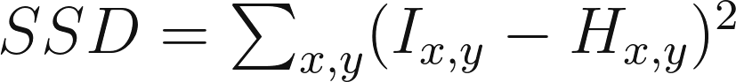
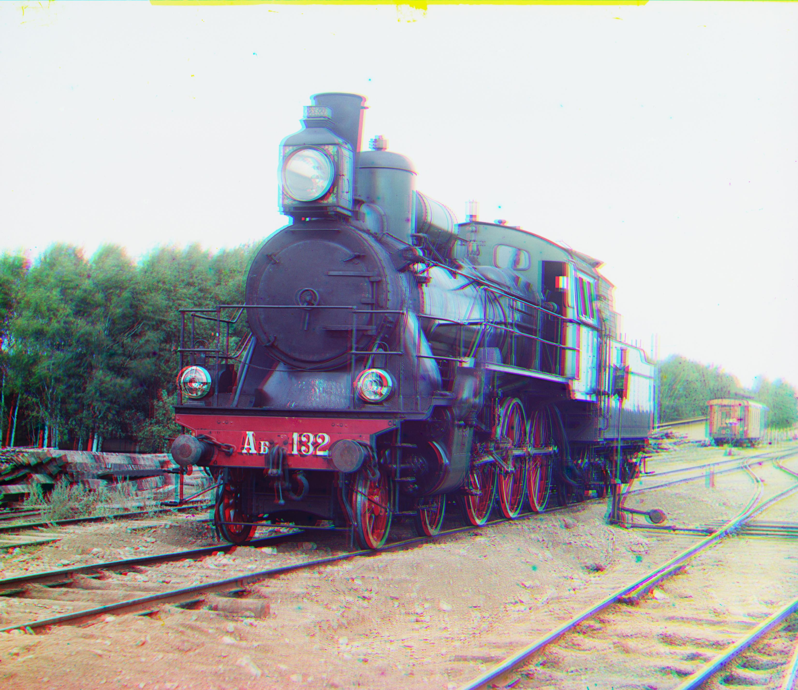
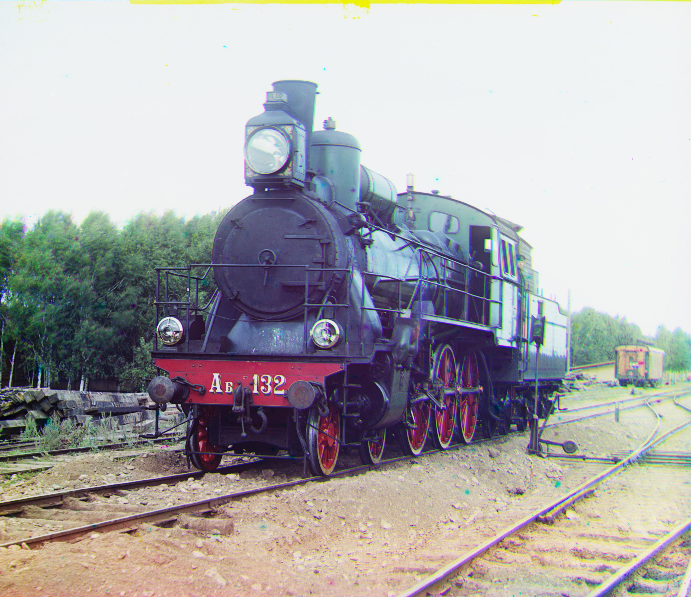
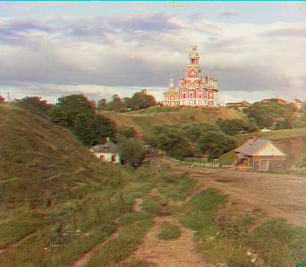
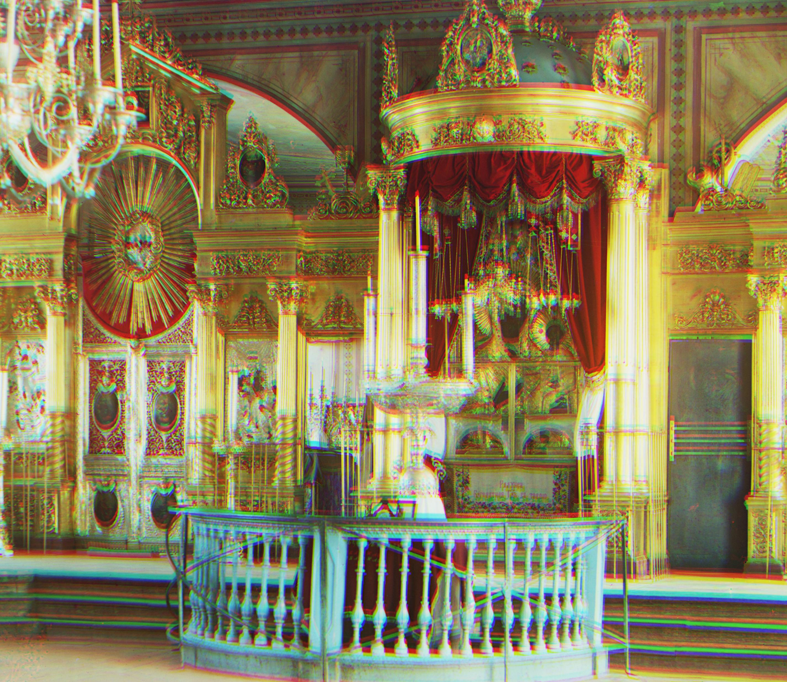
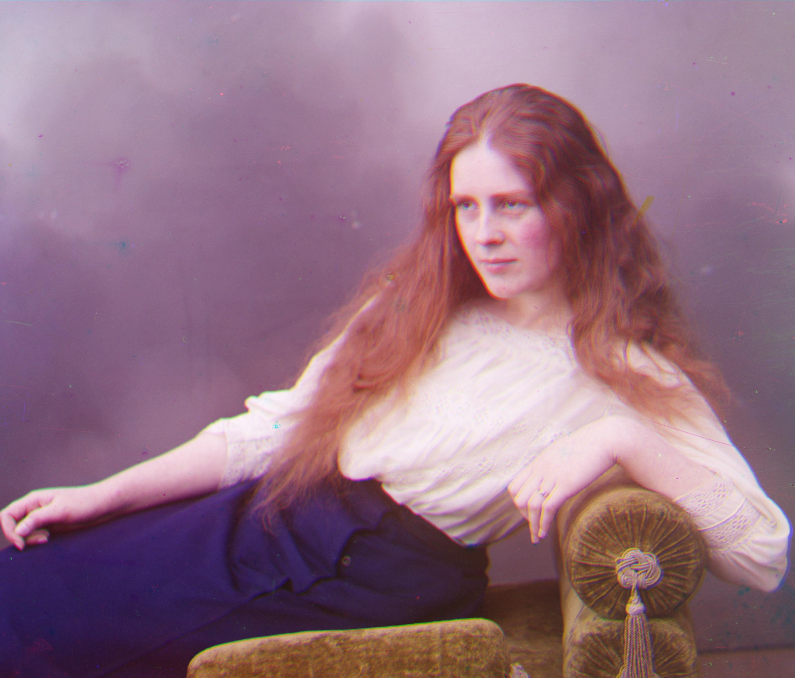
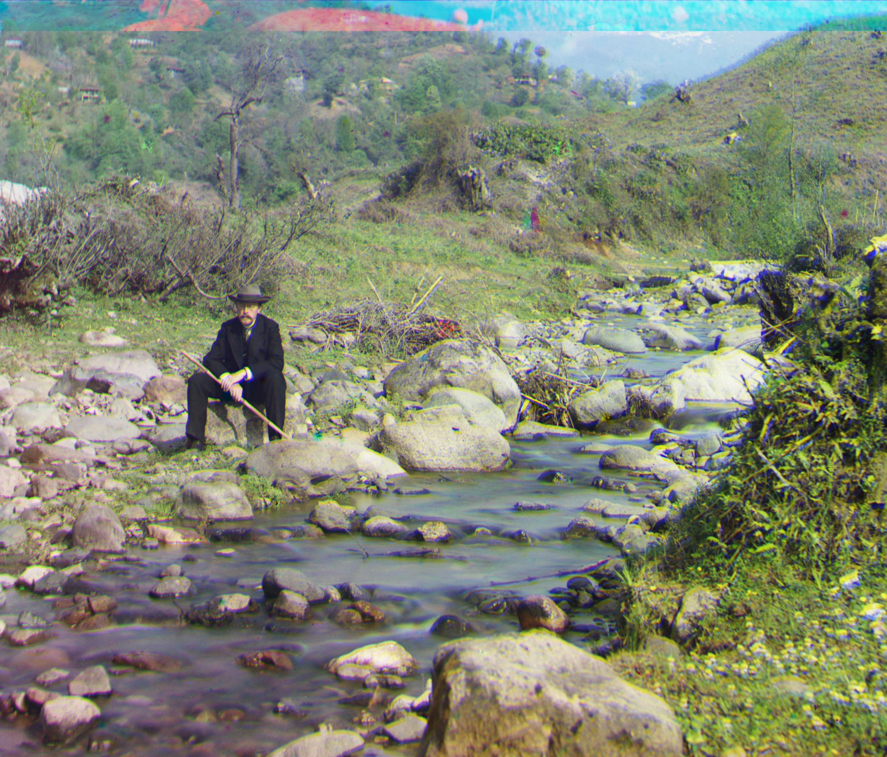
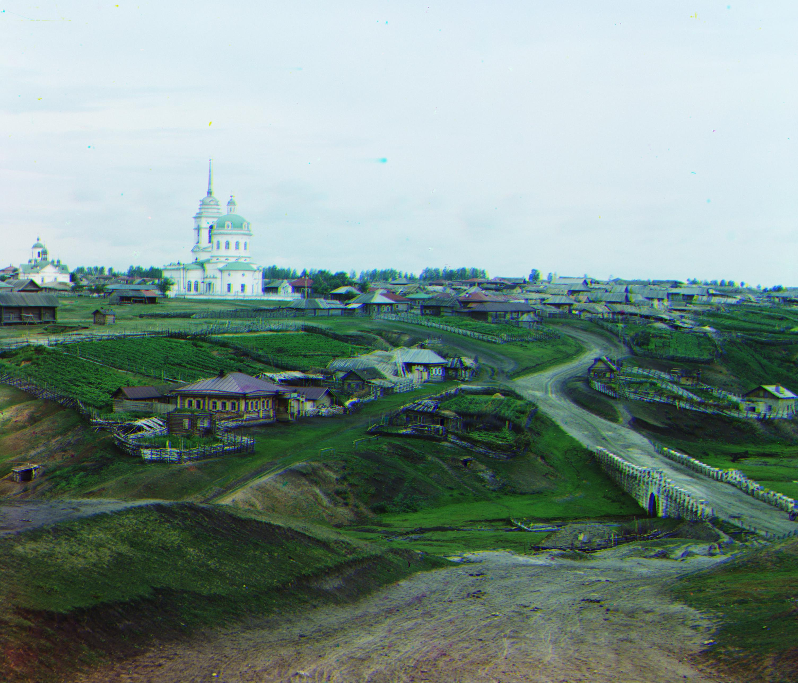

<!-- {{ <.TableOfContents> }} -->


# Colorizing the Prokudin-Gorskii Photo Collection
<!-- ------------------------------------------------ -->

<!-- _by Linji Wang, Feb 07, 2023_ -->

## Overview

This project requires you to use image processing techniques to create a color image from the digitized Prokudin-Gorskii glass plate photographs, with the goal of producing an image with as few visual artifacts as possible. A digital picture of a glass plate, with its three channels arranged from top to bottom as BGR (see Figure 1), serves as the process's input. Our task is to isolate the three channels and properly align them.

Figure 1. Digitized Glass Plate: Cathedral

### Matching Metric

Image matching means to manipulate image to ensure the best results for your similarity metrics. Thus, it is important to choose an efficient and accurate image matching metrics. For this assignment, I explored Sum of Squared Differences (SSD) and Normalized Cross Correlation (NCC) functions. The objective is to maximize or minimize one of these functions by searching and manipulating the images.

**Sum of Squared Differences** SSD is calculated based on the following equation:

where _I_ and _H_ are function of two images and x,y are pixels positions.

Figure 2. Cathedral: SSD, Shift:[0, -25],[7, -25] time cost: 2.13s

**Normalized Cross Correlation** NNC is calculated based on the following equation:

where \\mu I and\\mu H are the luminance of each image.

Figure 3. Cathedral: NCC, Shift:[0, -25],[7, -25] time cost: 9.59s

### Efficiency

In the above implementation, we construct two for loops to search for the best position in a small window. Comparing and searching image in a small image might work; however, it will take minutes to process a 3500 by 3500 image. We need additional algorithms to pursue efficiency:

**Image Pyramid Search** This is an efficient search algorithm that generally yields good results in less than 60 seconds for high resolution images—up to 9000 pixels. As mentioned above, this algorithm scales down the image by _scale\_factor_ times, being _scale\_factor_ an automated parameter based on the input image resolution. Given an initial window search, the algorithm searches from coarse to fine images, within the reduced window size, which decreases by a hyperparameter of _window\_size_ as the images become larger.  

<!-- https://en.wikipedia.org/wiki/Pyramid\_(image\_processing) -->

Let's first see how long will it take if we process a 3000 by 3000 image without pyramid search.

Figure 4. Train: SSD w/o Pyramid, time cost: 1857s

Figure 5. Train: NCC w/o Pyramid, time cost: 4486s

<!-- https://en.wikipedia.org/wiki/Pyramid\_(image\_processing) -->

Let's apply the pyramid search to see how it affect the searching.

Figure 6. Train: SSD with Pyramid, time cost: 19.03s

Figure 7. Train: NCC with Pyramid, time cost: 39.41s

Wow, I believe that is a huge performance increase. But the image quality seems not good enough. We will introduce a few of methods in the following part.

The following are the results with the Pyramid method.

### Pyramid Results

Figure 8. cathedral: Shift: [0, -16],[6, -16], time cost: 0.75s

Figure 9. emir: Shift: [-9, -78],[64, -35], time cost: 55.55s

Figure 10. harvesters: Shift: [64, -80],[64, -65], time cost: 56.50s

Figure 11. icon: Shift: [64, -80],[64, -80], time cost: 57.38s

Figure 12. lady: Shift: [64, -80],[64, -80], time cost: 57.11s

Figure 13. self_portrait: Shift: [42, -80],[64, -80], time cost: 58.93s

Figure 14. three_generations: Shift: [52, -80],[64, -80], time cost: 56.76s

Figure 15. train: Shift: [0, -65],[64, -70], time cost: 56.69s

Figure 16. turkmen: Shift: [64, -77],[64, -60], time cost: 64.72s

Figure 17. village: Shift: [17, -80],[64, -80], time cost: 61.30s

### Bells & Whistles

**Auto Border Crop**

The borders seem very annoying: 1. They don't contribute to the final results. 2. They can even mess our matching metric.

Let's try to build a simple border corp algo to handle it.

- 1. Define what is a border. Border usually is a long vertical or horizontal distinction between two parts. We can use this attribute as a start.

- 2. Detect the distinctions. Since the distinction is a huge difference between two parts, they can surely be detected by the edge detector. We utilize Canny Edge Detector for this problem, and define the longgest horizontal/vertical edge as the border. If the edge counts more than 90% of the height or width, we define it as the border and use the ratio as the crop ratio.

Let's see some images after we implementing the auto border crop.

Figure 18. Train: SSD with Pyramid, CROP, time cost: 34.05s

Figure 19. Train: NCC with Pyramid, CROP, time cost: 44.67s

The border got cropped before and after the image matching to ensure a clean image. However, the channels are still not matched very well.

**Edge Detector**

Maybe pixel intensity is not enough for the matching, other features like edges are also important. This time, we use Canny edges for SSD and NCC for image matching.

Figure 20. Train: SSD with Pyramid, CROP, Canny, time cost: 18.30s

Figure 21. Train: NCC with Pyramid, CROP, Canny, time cost: 43.35s

  

### Extra Credit

**Evolution Method: Covariance matrix adaptation evolution strategy (CMA-ES)** The Exhaustive Search can only work for small images and small window size, due to its time complexity of O(windowsize)^2. I propose a novel optimization approach to search the best alignment with CMA-ES. This black-box optimization algorithm consists on treating the search space as a multivariate Gaussian, with varying mean and covariance matrix. The algorithm starts with a population P, initial x and y movement, and initial covariance. We select elites by keeping a fraction of the population of 10% at each iteration, and noise epsilon is added to covariance at each step. We let the algorithm run for several iterations based on image size and set an initial Gaussian variance corroesponding to the windowsize. We optimize using the following equations:

Let's see this cool GIF to have an idea how the evolution method find the optimal values.

Figure 22. CMEAS parameter update process

 

Figure 23. CMEAS image update process

  

Figure 24. Train: SSD with Pyramid, Canny, CMEAS, CROP, time cost: 12.89s

Figure 25. Train: NCC with Pyramid, Canny, CMEAS, CROP, time cost: 25.77s

The CMEAS Evolution method brings 35% performance increase with more clear results.

### Final Results

Figure 26. cathedral: shift[[5, 2],[12, 1]]_time_cost 1.93s

Figure 27. emir: shift[[38, 16],[91, 18]]_time_cost 31.65s

Figure 28. harvesters: shift[[61, 13],[123, 13]]_time_cost 40.10s

Figure 29. icon: shift[[30, 16],[76, 22]]_time_cost 33.83s

Figure 30. lady: shift[[52, 7],[120, 4]]_time_cost 31.90s

Figure 31. self_portrait: shift[[74, 25],[167, 19]]_time_cost 32.29s

Figure 32. three_generations: shift[[44, 6],[106, 6]]_time_cost 38.12s

Figure 33. turkmen: shift[[56, 20],[105, 21]]_time_cost 34.34s

Figure 34. village: shift[[63, 3],[136, 20]]_time_cost 38.50s

Figure 35. train: shift[[41, 0],[78, 23]]_time_cost 46.49s
