<!-- {{ <.TableOfContents> }} -->


<!-- HW 2   table { border-collapse: collapse; margin: 0 auto; width: 50%; } th, td { padding: 8px; text-align: center; border: 1px solid #ddd; }    body { font-family: 'Lato', sans-serif; } .mySlides { display: none; }

 "Toggle Navigation Menu")[HOME](#) [About Me](#band)

Projects

[Project0](#proj_0) [Project1](#proj_1) [Project2](#proj_2)

)

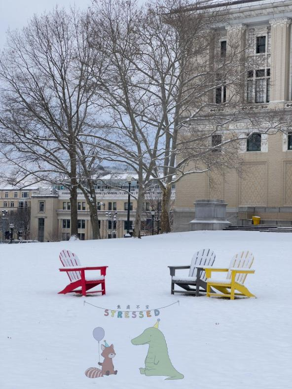  -->

Gradient Domain Fusion
----------------------

_by Linji Wang, Feb 07, 2023_

### Overview

<!-- Column 1

Column 2

Column 3

 -->

Welcome to our website about Gradient Domain Fusion, a powerful technique that allows for seamless merging of multiple images into a single high-quality output. Our project aims to explore this technique and provide a detailed guide on how to implement it effectively.  
Whether you are a professional photographer or a hobbyist looking to take your images to the next level, our website is the perfect resource to learn about and master Gradient Domain Fusion. So, let's get started and unlock the full potential of this exciting technique!

### Toy Problem

In this toy example, we're trying to reconstruct an image called "v" using some information we get from another image called "s". Specifically, we're going to use the x and y gradients of the image s, as well as the intensity of one of its pixels.  
  
Now, you might be wondering what "x and y gradients" mean. Think of it this way: imagine looking at a picture of a mountain. If you wanted to describe how the brightness of the image changes as you move your eyes across it, you might say something like "the brightness gets darker as you move up the mountain, and lighter as you move down." That's kind of what we mean by "gradients" - they describe how the brightness (or "intensity") of an image changes in different directions.  
  
So, to summarize: we have one image called "s", and we're going to use its x and y gradients (which describe how the brightness changes in different directions) and the intensity of one pixel to create a new image called "v". The process isn't too complicated, but it's easy to make mistakes, so we're starting with a simple example to make sure we get it right.

**Results: toy problem** Left side: Original image; Right side: Reconstructed Image

\--> 

### Poisson Blending

The first step in Poisson blending is to identify the target region in the image, which is the area where we want to blend the images together. For example, if we have two images of a person and a background, the target region might be the outline of the person.  
  
Next, we need to construct blending constraints. The goal of these constraints is to ensure that the blended image looks seamless and natural. We do this by making sure that the brightness or intensity of the target region is consistent with the gradients of the source and target images.  
  
To create these constraints, we use the gradient of the images. The gradient describes how the brightness or intensity of the image changes in different directions. We create a set of equations that relate the gradient of the target region to the gradients of the source and target images. These equations are based on the observation that the gradient of the target region should be equal to the gradient of the source image in the non-target region, so as to ensure smooth blending.  
  
Once we have the blending constraints, we need to solve a least squares problem to find the values for each pixel in the target region that satisfy these constraints. The solution involves finding the values that minimize the difference between the gradient of the target region and the gradients of the source and target images, subject to the blending constraints. This can be done using numerical optimization methods.  
  
Finally, we construct the blended image by copying the pixels from the source image into the target region, adjusting their colors and intensities according to the solution of the linear equations. This creates a smooth transition between the target region and the rest of the image, resulting in a final image that looks natural and seamless.  
  
In summary, Poisson blending involves identifying the target region, constructing blending constraints based on the gradients of the images, solving a least squares problem to find the values for each pixel in the target region, and then constructing the final image by copying the pixels from the source image and adjusting their colors and intensities. The result is a seamless and natural-looking image.

**Results: poisson blend** Left side: Naive Blend; Right side: Poisson Blend

\--> 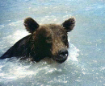

Source: A Bear

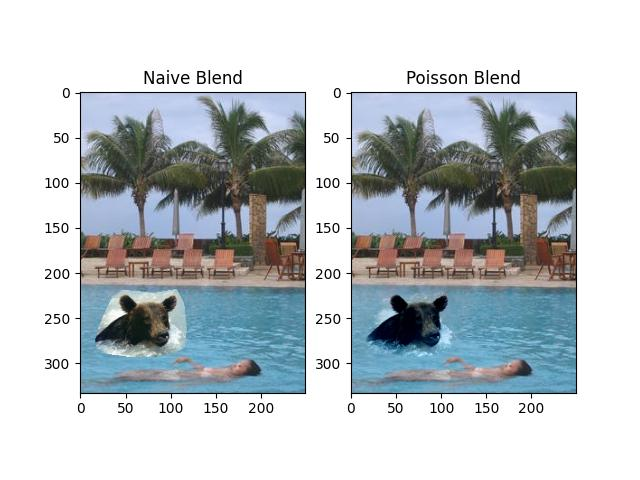

A Bear swimming with a girl in a pool

Source: A Whale

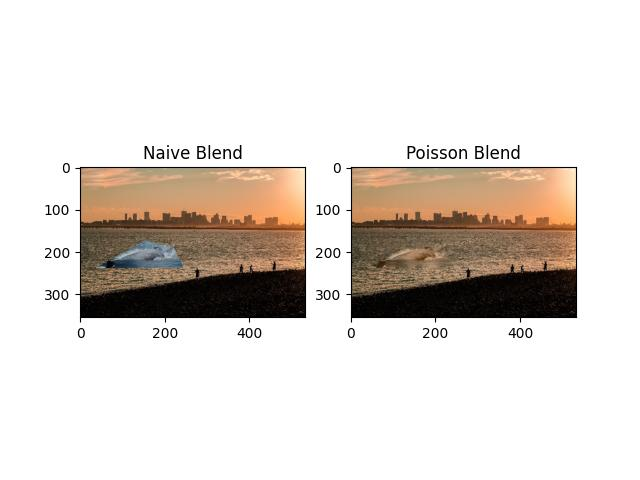

A Whale swimming at the sea of Boston

Source: A man

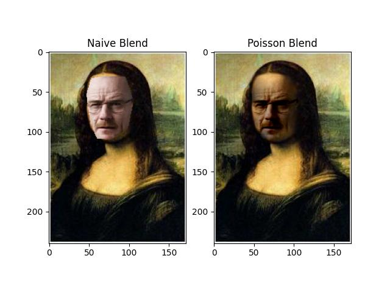

Mona Lisa with a man's face

Source: A cat

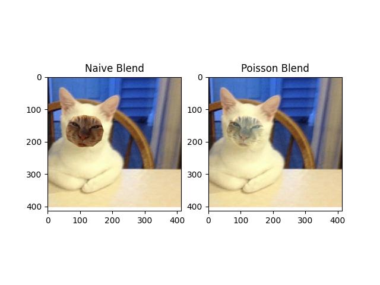

A cat with another cat's face

Source: A cat

A cat with another cat's face

Source: A snowman

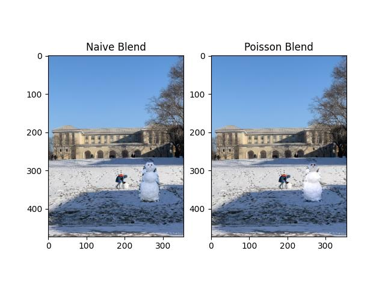

A snowman standing at The Mall, CMU

Source: A painting

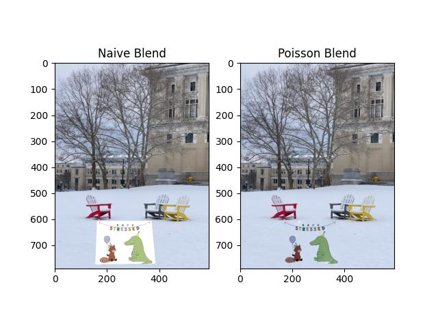

A painting at College of Fine Arts Lawn, CMU

### Mixed Poisson blending

To elaborate, Mixed Poisson blending is a variation of Poisson blending that is used to blend images with different color channels or color spaces. The process involves identifying the target region, constructing blending constraints, and solving a least squares problem to find the values for each pixel in the target region.  
  
The blending constraints are based on the idea that the brightness or intensity of the image should be consistent across the boundary between the target region and the rest of the image. In Mixed Poisson blending, these constraints are constructed by taking the greatest gradient in the image and using it to construct a sparse matrix.  
  
The sparse matrix is used to solve the least squares problem, which involves finding the values for each pixel in the target region that satisfy the blending constraints. The solution involves using iterative methods to find the optimal solution that minimizes the difference between the gradients of the target region and the greatest gradient of the image, subject to the blending constraints.  
  
The resulting pixel values are combined to create the final blended image, which maintains the colors and textures of each image while appearing seamless and natural.  
  
In summary, Mixed Poisson blending is used to blend images with different color channels or color spaces. The blending constraints are constructed using the greatest gradient in the image to create a sparse matrix, which is then used to solve the least squares problem and find the pixel values in the target region. The resulting blended image maintains the colors and textures of each image, while appearing seamless and natural. **Results: Mixed poisson blend** Left side: Naive Blend; Right side: Mixed Poisson Blend

### Mixed Poisson blending

\--> 

Source: A Bear

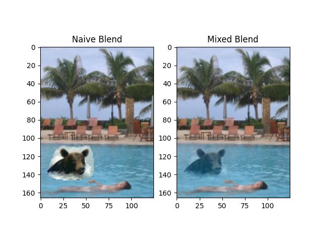

A Bear swimming with a girl in a pool

Source: A Whale

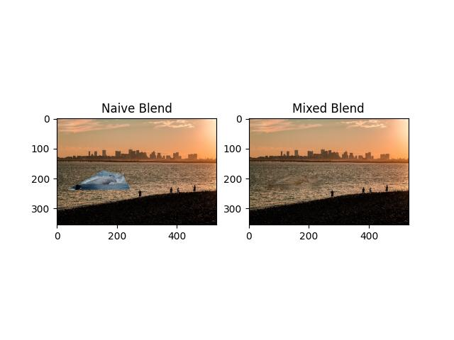

A Whale swimming at the sea of Boston

Source: A man

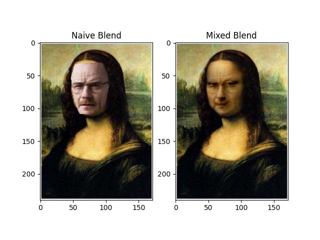

Mona Lisa with a man's face

Source: A cat

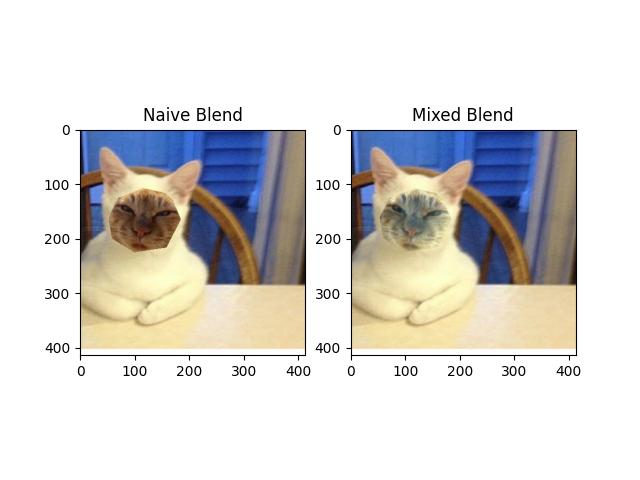

A cat with another cat's face

Source: A cat

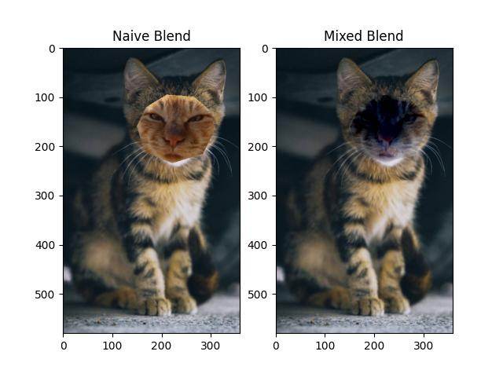

A cat with another cat's face

Source: A snowman

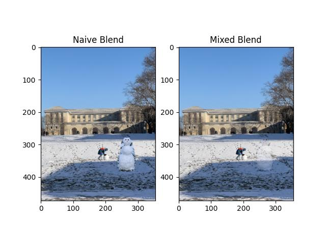

A snowman standing at The Mall, CMU

Source: A painting

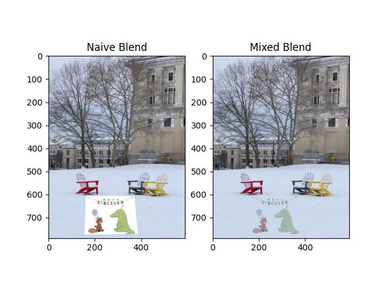

A painting at College of Fine Arts Lawn, CMU

### Color2Gray

The color2gray problem refers to the challenge of converting a color image to a grayscale image while preserving the essential information. Grayscale images are often used in applications such as printing, where color images may not be necessary or may be too expensive to produce.  
  
One approach to solving the color2gray problem is to convert the image to the HSV (Hue, Saturation, Value) color space. The HSV color space separates color information into three channels: Hue, Saturation, and Value. The Hue channel represents the color itself, while the Saturation and Value channels represent the intensity of the color.  
  
In the HSV color space, we can notice the color difference between channels, which can help us to preserve the essential information when converting to grayscale. One technique for converting an HSV image to grayscale is to use Mixed Poisson Blending. This technique involves solving a least squares problem that takes into account the greatest gradient in the image to construct a sparse matrix. The sparse matrix is used to find the values for each pixel in the target region, resulting in a grayscale image that maintains the essential information from the original color image.  
  
In summary, the color2gray problem refers to the challenge of converting a color image to grayscale while preserving the essential information. In the HSV color space, we can notice the color difference between channels, and Mixed Poisson Blending can be used to solve the color2gray problem while maintaining the essential information.

A colorBlindTest image

A Gray colorBlindTest image and its HSV distributions

