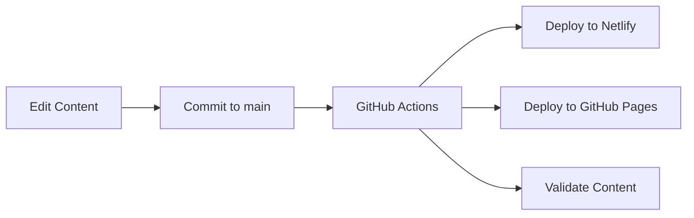

# Enhanced Website Workflow Documentation

## 🎯 Overview

This personal website now features an enhanced workflow with:
- **Dual deployment** to both linjiwang.com (Netlify) and linjiw.github.io/linjiwang (GitHub Pages)
- **Automated resume generation** from a single YAML source
- **Version control** for all content and resume iterations
- **Content validation** and quality checks

## 🚀 Quick Start

### Initial Setup
```bash
# Run the setup script
./scripts/setup-website.sh

# Install Hugo if not already installed
brew install hugo
```

### Local Development
```bash
# Start local server
hugo server -D

# View at http://localhost:1313
```

### Generate Resume
```bash
# Generate all formats (PDF, Markdown, JSON)
python3 scripts/build-resume.py

# Generate specific format
python3 scripts/build-resume.py --format pdf
python3 scripts/build-resume.py --format markdown
```

## 📁 Project Structure

```
linjiwang/
├── .github/workflows/       # GitHub Actions workflows
│   ├── deploy.yml          # Dual deployment workflow
│   ├── resume-generator.yml # Automated resume generation
│   └── validate.yml        # Content validation
├── content/
│   ├── resume/
│   │   ├── data.yaml       # Single source of truth for resume
│   │   └── index.md        # Auto-generated web version
│   ├── post/               # Blog posts
│   └── project/            # Research projects
├── scripts/
│   ├── build-resume.py     # Resume generation script
│   └── setup-website.sh    # Setup helper
├── static/files/
│   ├── cv.pdf              # Current resume PDF
│   └── resume-versions/    # Historical versions
└── CLAUDE.md               # AI assistant instructions
```

## 🔄 Workflows

### 1. Content Update Workflow


### 2. Resume Update Workflow
1. Edit `content/resume/data.yaml`
2. Run `python3 scripts/build-resume.py`
3. Commit and push changes
4. GitHub Actions automatically:
   - Generates PDF with timestamp
   - Updates website with new version
   - Archives previous versions

### 3. Multi-Domain Deployment
- **Primary**: linjiwang.com (via Netlify)
- **Secondary**: linjiw.github.io/linjiwang (via GitHub Pages)
- Both update automatically on push to main branch

## 📝 Resume Management

### Data Structure
The resume is maintained in `content/resume/data.yaml` with sections:
- Personal information
- Education
- Experience
- Skills
- Publications
- Awards
- Projects

### Output Formats
From a single YAML source, we generate:
- **PDF**: Professional CV for applications
- **Markdown**: Web-friendly version for the site
- **JSON**: Structured data for APIs

### Versioning
- Current version: `/static/files/cv.pdf`
- Named version: `/static/files/Linji Wang CV site-linji.pdf`
- Archives: `/static/files/resume-versions/cv_YYYYMMDD.pdf`

## 🛠️ Development Commands

### Build Commands
```bash
# Development build with drafts
hugo server -D

# Production build
hugo --gc --minify

# Build for specific URL
hugo --gc --minify --baseURL "https://linjiw.github.io/linjiwang/"
```

### Resume Commands
```bash
# Update resume data
nano content/resume/data.yaml

# Generate all formats
python3 scripts/build-resume.py

# Generate PDF only (requires LaTeX)
python3 scripts/build-resume.py --format pdf
```

### Git Commands
```bash
# Standard workflow
git add .
git commit -m "Update resume/content"
git push origin main

# The push triggers:
# 1. Netlify deployment
# 2. GitHub Pages deployment
# 3. Content validation
```

## 🔍 Content Validation

The `validate.yml` workflow automatically checks:
- ✅ Broken links in Markdown files
- ✅ Large image files (>2MB warning)
- ✅ Hugo build errors
- ✅ Basic accessibility tests

Run validation locally:
```bash
# Check for broken links
find . -name "*.md" | xargs -I {} markdown-link-check {}

# Check image sizes
find . -name "*.jpg" -o -name "*.png" | while read img; do
    size=$(stat -f%z "$img")
    if [ "$size" -gt 2097152 ]; then
        echo "Warning: $img is larger than 2MB"
    fi
done
```

## 🌐 Domain Configuration

### Netlify (Primary)
- Domain: linjiwang.com
- Auto-deploys from main branch
- Configuration: `netlify.toml`

### GitHub Pages (Secondary)
- Domain: linjiw.github.io/linjiwang
- Deployed via GitHub Actions
- CNAME file auto-generated

## 📊 Features

### Current Features
- ✅ Hugo static site generation
- ✅ Responsive academic theme
- ✅ Blog with Jupyter notebook support
- ✅ Project galleries
- ✅ Automated resume generation
- ✅ Multi-domain deployment
- ✅ Content validation

### Planned Enhancements
- [ ] A/B testing between versions
- [ ] Analytics dashboard
- [ ] SEO optimization
- [ ] Progressive Web App (PWA)
- [ ] Dark mode toggle
- [ ] Multi-language support (EN/CN)

## 🐛 Troubleshooting

### Hugo Not Found
```bash
brew install hugo
```

### LaTeX Not Available (for PDF generation)
```bash
# macOS
brew install --cask mactex

# Or use Docker
docker run --rm -v $(pwd):/workspace texlive/texlive pdflatex resume.tex
```

### Python Dependencies
```bash
pip3 install --user pyyaml jinja2 markdown
```

### GitHub Actions Failing
1. Check Settings > Pages > Source is set to "GitHub Actions"
2. Ensure repository has Actions enabled
3. Check workflow logs for specific errors

## 📚 Resources

- [Hugo Documentation](https://gohugo.io/documentation/)
- [Wowchemy Theme](https://wowchemy.com/docs/)
- [GitHub Actions](https://docs.github.com/en/actions)
- [Netlify Docs](https://docs.netlify.com/)

## 🤝 Contributing

1. Create feature branch: `git checkout -b feature/new-feature`
2. Make changes and test locally
3. Commit: `git commit -m "Add new feature"`
4. Push: `git push origin feature/new-feature`
5. Create Pull Request

## 📄 License

MIT License - See LICENSE.md for details

---

*Last updated: November 2024*